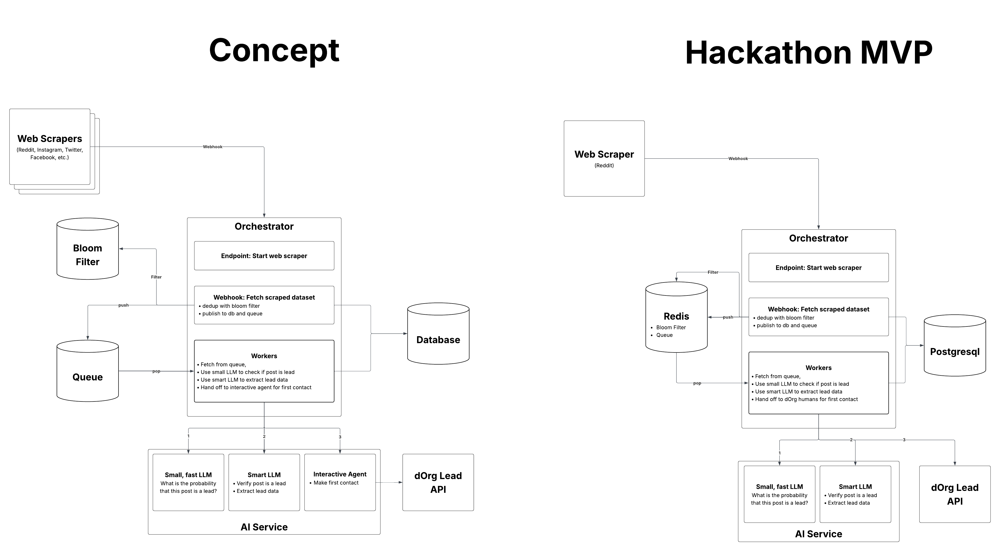

# dorg-gtm-agent

This repository contains the code for a dOrg GTM Agent hackathon submission. The dOrg GTM Agent is a system that uses LLMs to extract lead data from social media posts. My strategy is to scrape all social media posts at specified URLs and search terms, and then to check each post to see if it contains a sales lead for the dOrg software development consultancy.

Process:
- Scrape all social media posts at specified URLs and search terms
- Estimate probability that a post is a lead using a small LLM
- Extract lead data with larger LLM
- Hand off to human or smart LLM for outreach

## System Design

The dOrg GTM Agent is a distributed system designed to automate lead generation by crawling social media and using AI to qualify and extract information from potential leads. The system consists of three main services and two infrastructure components:

- **GTM Web Crawler**: A specialized crawler built with Crawlee and hosted on Apify. It targets Reddit subreddits to collect posts while using anti-detection measures to respect platform limits.
- **GTM AI**: A Mastra-based service that performs AI analysis. It features a fast, low-cost LLM to filter high-probability leads and a more capable LLM to extract detailed lead data, such as needs, timing, and contact information.
- **GTM Workers**: Orchestrates the lead lifecycle. It includes an API to trigger crawls and handle webhooks from Apify, and a background worker that processes the queue of posts, manages the lead pipeline, and integrates with the dOrg API to claim and surface qualified leads.
- **Infrastructure**: Uses **PostgreSQL** for persistent storage of lead data and **Valkey (Redis)** for efficient message queuing and URL deduplication via Bloom filters.



## Packages

This repository contains independent Bun packages:

- `gtm-ai`
- `gtm-workers`
- `gtm-web-crawler`

Each package has its own `package.json` and `bun.lock`.

## Install dependencies

Install dependencies from each package directory:

```bash
cd gtm-ai && bun install
cd gtm-workers && bun install
cd gtm-web-crawler && bun install
```

## Run with Docker Compose

From the repository root:

```bash
docker compose up --build
```
